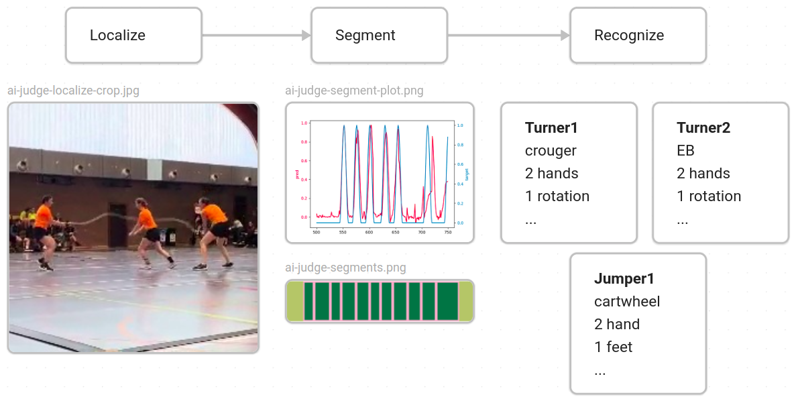
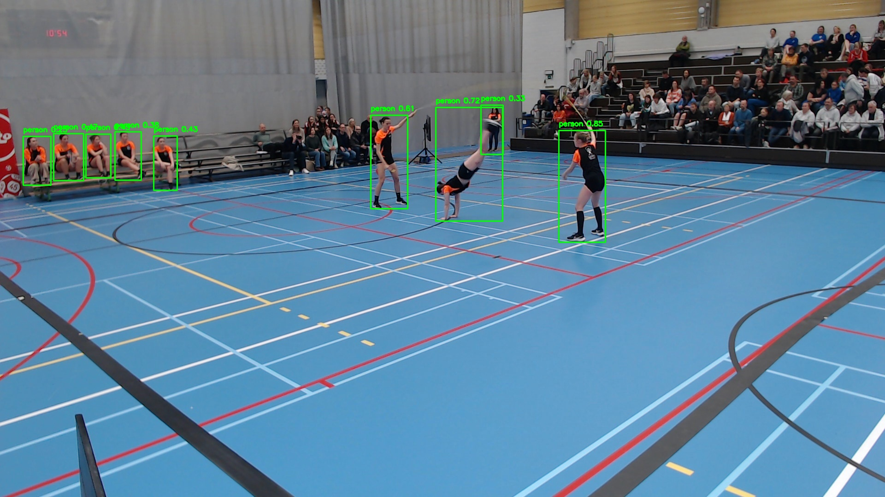
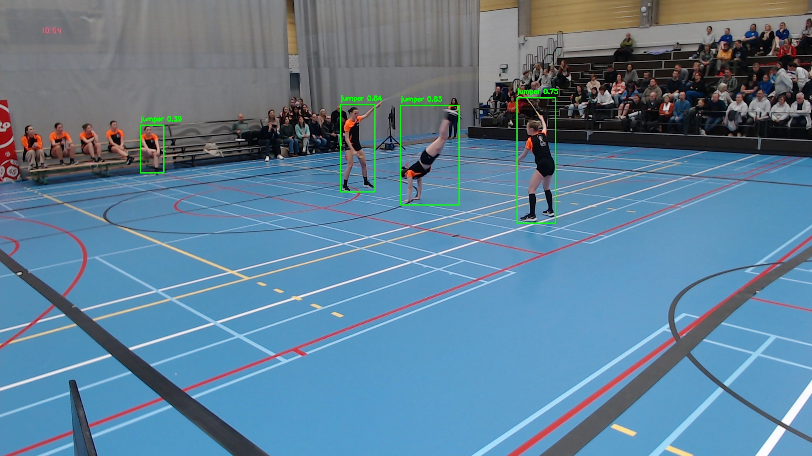

# The AI judge assistent repo

Note that, in the last couple of weeks (after my thesis completement) some major adaptions have taken place, so not codeflows may work.

## Recognizing jump rope skills in videos

During my thesis: focus on Double Dutch Single Freestyles (DD3)
After my thesis, a general recognition architecture is built, which should be able to recognize not only DD3 skills, but also other jump rope events, such as Single Rope, or chinese wheel.

The general flow of predictions is a three step architecture, localizing the positions of athlete (object localization), isolating individual skills (segmentation) and predicting the skill (classification/recognition).



### Jumper Localization

Jumper localization crops the athletes, frame by frame in a full video.
This uses [Ultralytics YOLOv11](https://github.com/ultralytics/ultralytics), licensed under AGPL-3.0.

Jumpers are labeled individually as a **foreground-person**, while spectators are labeled as **background-person**s. This makes the model capable of distinguishing between athlete and spectator.

(Images below are old images, when only athletes where labeled)

 

Cropping around all athletes for every frame in a full video, creates a cropped video, which is used to train the segmentation and recognition models.

### Segmentation

Segmenting each individual action so that it can be recognized.
Currently, only uses the [Multiscale Video Transformer](https://docs.pytorch.org/vision/main/models/video_mvit.html)

Idea: Merge with localization in a single model.

### Recognition

Eventually, each section can be transformed into a (1, 3, 16, 224, 224) input, (batch_size, channels, timesteps, height, width) or (B, C, T, H, W). Or future other sizes, maybe depeding on the model.

Old image, prior to skill label changes.

[Video example](https://1drv.ms/v/c/6fa18b11a53f88a6/EWeE_YUHgkVJrhSFT4LIC3UB1WxjQLyZky4oNIUlqaqbQA?e=DBke8i)

For full details see [paper](./paper/bachelorproef/DeDeckerMikeBP.tex), preferably compile it from a [pdf](https://github.com/mikeddecker/judge/blob/main/paper/bachproef/DeDeckerMikeBP.pdf)

### Double Dutch Single (DD3) Data

(private)
- Freestyles from Belgium (as competed in national competitions e.g. [Belgium](https://gymfed.be))
- Freestyles from international athletes ([IJRU](https://ijru.sport/)))

### Physical devices for training

(During thesis, after thesis, other machines can be used) \
Laptop Acer Nitro ANV15-51, running Ubuntu 24.04.2 LTS, using a 13th Gen Intel® Core™ i5-13420H × 12, with 16GB RAM and a
NVIDIA GeForce RTX™ 4050 Laptop GPU 5898MiB.

### Installation guide

Prerequisites
- Install Node.js version 18.3 or higher
- Install Docker (& Docker compose) - used for the mysql database

There are 3 projects:
- [API](./api/README.md) - providing data to the web app & containing docker logic
- [Web](./web/README.md) - Interface to:
  - Browse videos
  - Label localization or skills
  - Launch training of models
  - View video and model statistics
- [CV/Computer Vision](./computervision/README.md) - providing a job executor training AI models.

### Starting up

When everything is installed, you can start the projects.

1. In the api folder - start up docker - `docker compose up -d`
2. In the api folder - `python app.py`
3. In the web folder - `npm run dev`
4. In the computervision folder - `python JobExecutor.py`

### BACKUP

Use your personal file paths:

```bash
mysqldump -h 127.0.0.1 -P 3377 -u root -p judge > "/media/miked/Elements/Judge/FINISHED-DB-READY/$(date +\%Y\%m\%d)_judge_dump.sql"
```

### Clean requirements & update

This is a set of commands to clean-up the requirements.txt file (in the api and computervision project)
The last install is run again to make sure there aren't to much packages deleted.
```bash
pip install --upgrade pip-chill
pip-chill > requirements.txt
pip install --upgrade -r requirements.txt
comm -23 <(pip freeze | sort) <(pip-chill | sort) > unused.txt
xargs pip uninstall -y < unused.txt
pip install --upgrade -r requirements.txt
rm unused.txt
```

