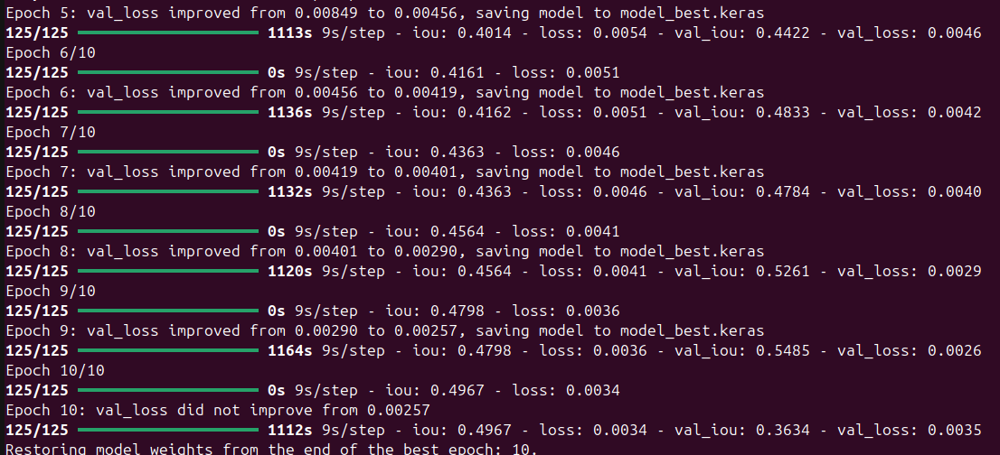

# Notes

GoogleNet was overfitting
Random model was at 45% iou after 7 epochs, 3k images.

MobileNetV3 small didn't result in better results either, 40% after 10 epochs,
Could be due to the nature of preprocessing.

