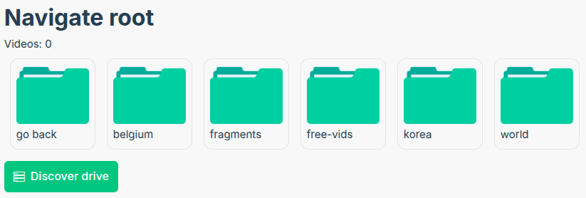
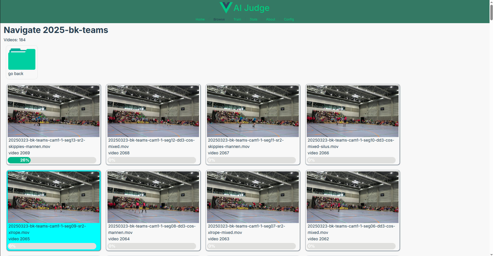
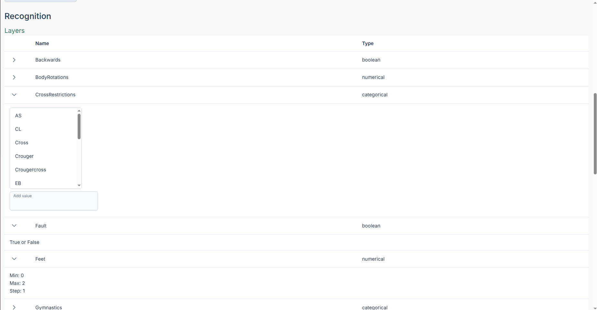
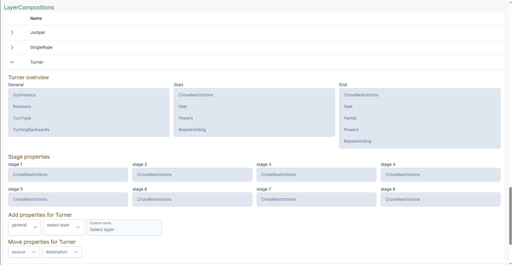
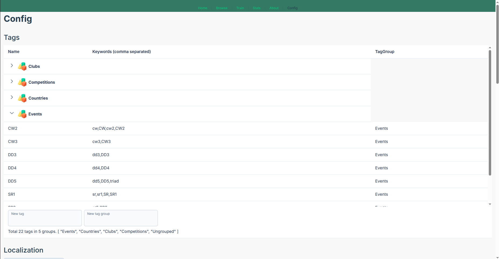
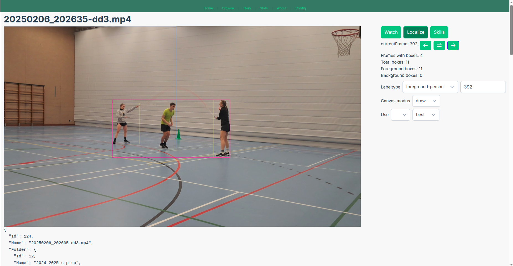
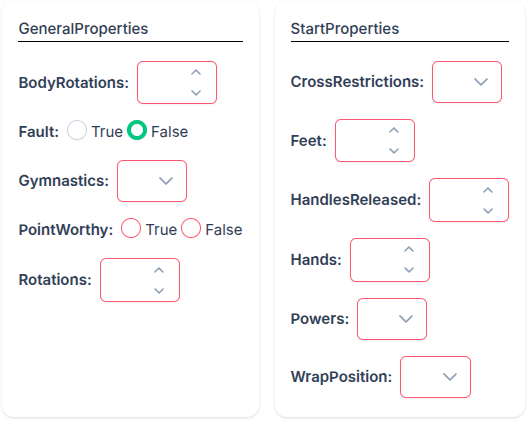
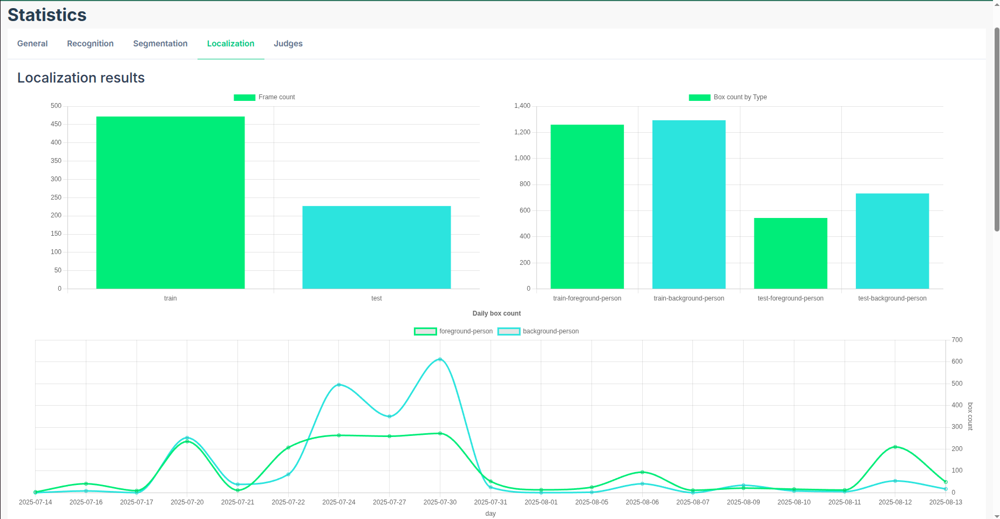
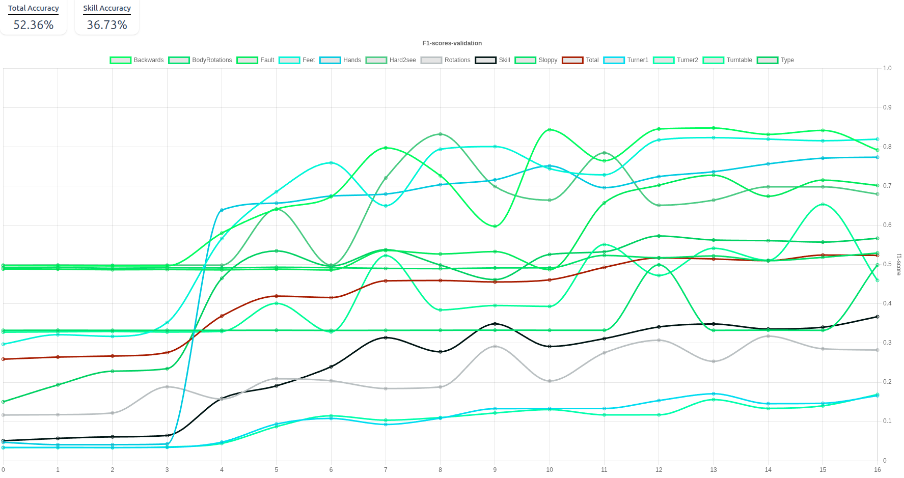

# web

This template should help get you started developing with Vue 3 in Vite.

## Screens

### Browse videos

Navigate to videos in order to label them. \
Displays videos which are discovered in the `api/.env` variable `STORAGE_DIR_VIDEOS`
Click on the discover button to run the script which explores the video folder.

Videos are visable as a clickable card. It will display a random image and a progressbar. This is a target to indicate how many localize boxes a video has. (The target is 100, so 23 boxes = 23%, see label localization for more info.)

10 percent of the videos are test videos. They are marked blue and end with a 5.

If a video is deemed to have labeled all skills, a checkmark will appear on the card.




### Configure Tags, Layers, LayerCompositions & Judge Rulesets

#### Layers

In order to recognize skills, a description on what skills are must be created. This is done by creating re-usable properties.
For example, a single rope freestyle has multiple unders. You can do a cross restriction on the first rotation, but also a different one on the second, third or fourth rotation. Thats why you need to define re-usable Layers or Properties.

Layers can be one of three types:
- Booleans (true or false)
- Categorical values (0, a, b, c, d, ...) (zero always included)
- Numerical values (minimum, maximum, step)
  - The step is used in the metrics, or for applying judge rulesets.

Upcomming feature: specify default value of a layer. 



#### Layer compositions

Making an ensemble of the layers for one athlete-entity.
E.g. turner, jumper, single rope.
The idea is that each entity can later (in future models) be mapped to labeled athlete boxes on the video! That's why you need to **label them from left to right**!

To make the architecture a general, not just for jump rope, it is created using stages. Mind the word `stages` as you have `GeneralProperties`, `StartProperties`, `EndProperties` and in between an undefined number of `StageProperties`.

- Add layers to these stages to create a `LayerComposition`.
- Move layers from one stage to another (also updates labels).



#### Tags

You can add tags to videos by specifying tags and taggroups.
This table is highly editable. Toggle rows or click on a row cell to edit. Add keywords (comma seperated) for tag discovery.

(No method yet to actually apply/add tags)



Future usage of tags:

- Select default layercomposition (e.g. DD3 - 2 Turners, 1 Jumper)
- Statistics based on tags (e.g. accuracy on DD3, SR1...)
- Potential idea: layers created per tag (as they are output heads)
- Rename videos based on tag order
- Filter videos by tags
- Most needed: creating judging rules to score athletes

#### Judging rule sets

A future feature. Diff levels during my thesis were code-based and not rule-based / editable or configurable

### Video page

Open the video: You have 3 options: watch, localize and skills.
Watching doesn't need extra attention, localize and skills are pages where you can label boxes and skills.

### Label localization

This screen is explained top to bottom.

1. Next to the current frame, you have 3 arrow buttons.
It will navigate you to the previous or next labeled frame or it will show a new random frame.
2. It shows stats on how many frames and boxes have been labeled.
3. Select which type of label you are working with (`foreground-person` or `background-person`),  next to the select option, you can edit/choose a frameNr yourself. (In case you want to also label a few frames before or after the current one, which comes in handy, because during fast moving skills, the current models (YOLO) isn't accurate or does not predict the athlete.)
4. Choose what you wanna do with the box labels:
   1. `Draw`: Hover over the image, click, hold & drag to draw the box
   2. `Edit`: Not yet implemented
   3. `Delete`: Hover over a box or overlapping boxes which you want to delete. 
   4. `Accept`: Hover over a predicted box to *accept it as the current selected labeltype*. (max 1, because YOLO can predict predict 2 classes at the same time)
5. Label boxes by using box predictions.
   1. Select the model you want to predict with. 
      - `yolo11n` nano 
      - `yolo11s` small 
      - `yolo11m` medium 
   2. Select the weights you want to predict with. 
      - `best` = jump rope weights after fine-tuning
      - `default` = Ultralytics yolo weights on COCO dataset.
      - (It could be interesting to switch between the 2, as you don't know which spectators are recognized in the background. Currently more time/focus is spent on labeling foreground athletes, sometimes skipping spectators.)
   3. A button will appear to launch the job.
   4. It will take about 20-30s to predict the skills, they will be displayed as soon as they are available.
   5. When you revisit a video, which has predictions, predicted boxess will only be drawn if any value is selected in the Use select dropdown.



### Label skills

Navigate the video by the default video controls or:
- Navigating `+X` or `-X` frames in the video
- Set/select start frame
- Set/select end frame
- Replay the selected section
- Deselect the selected section (sets start frame to frame end)
- Play the next section (if available)

Annotate the selected skill (from left to right):
- Add layercompositions (e.g. `Jumper`, `Turner`) or by tag (future feature)
- Adjust the properties of each layercomposition.
- Duplicate the values of the current composition to all others
- Delete (accidental) layercompositions. (e.g. added turner instead of single rope)
- Side note: if additional layers are added later, they'll be masked in the AI model. In other words, if musicality or execution is added later on, current labels can be preserved. Missing labels are indicated as invalid. (see image)
- As said earlier, specific default values are yet to be implements. So if you have a boolean which is by default true, you currently need to specify this for each skill currently. Idem with numeric or categorical values.
- Future feature (skill level displayed)
- Future idea: Select label focus -> e.g. label only musicality or execution -> mask all other properties (e.g. multiple.) -> layercomposition is the preset, so the idea is to add the full preset and fill in the values or activate only selected properties.




### Stats pages

#### General

To be implemented
- Video count, total frame count, videos per fps, videos per dimensions, size, length
- Videos with labels, videos without
- Videos by tag
- Videos by train/test

#### Localization

- Count of frames train/test
- Count of boxes per train/test/foreground/background
- Daily box count (& cummulative)
- Model comparison

Future: more stats

#### Segmentation

= empty

#### Recognition

- Skill count train/test
- (Current best) model property f1 accuracy graph

For each of Total & Layercomposition (e.g. Turner, Jumper, SR)
- Total amount of labeled layers
- Count of each property value (e.g. AS: 12, CL: 23, open/0: 1031, toad: 8)

Future more stats
- Skill counts / tag
- Skill counts / layercomposition

#### Judges

To be updated (after adding rulesets): \
Judge scores vs AI scores




## Installation guide

### Recommended IDE Setup

[VSCode](https://code.visualstudio.com/) + [Volar](https://marketplace.visualstudio.com/items?itemName=Vue.volar) (and disable Vetur).

### Customize configuration

See [Vite Configuration Reference](https://vite.dev/config/).

### Project Setup

```sh
npm install
```

#### Compile and Hot-Reload for Development

```sh
npm run dev
```

#### Compile and Minify for Production

```sh
npm run build
```

#### Run Unit Tests with [Vitest](https://vitest.dev/)

```sh
npm run test:unit
```

#### Run End-to-End Tests with [Cypress](https://www.cypress.io/)

```sh
npm run test:e2e:dev
```

This runs the end-to-end tests against the Vite development server.
It is much faster than the production build.

But it's still recommended to test the production build with `test:e2e` before deploying (e.g. in CI environments):

```sh
npm run build
npm run test:e2e
```

#### Lint with [ESLint](https://eslint.org/)

```sh
npm run lint
```

